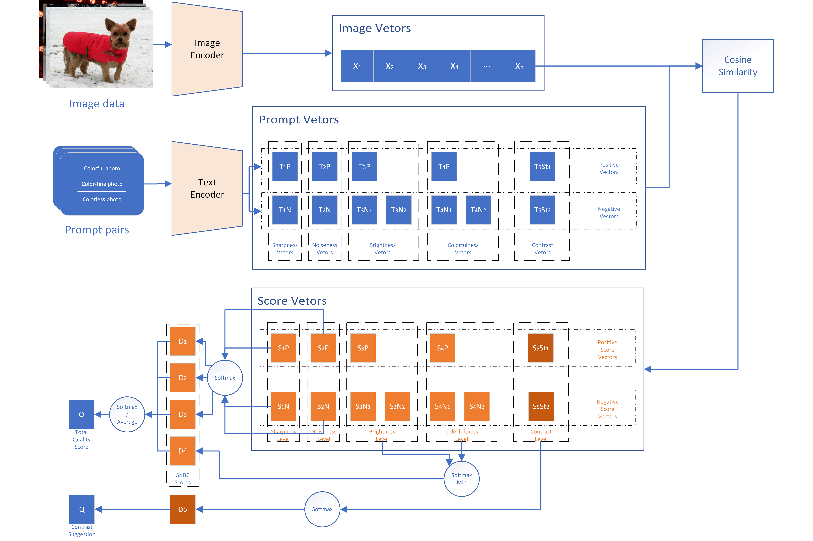

# MAGIC-IQA——一种零样本学习的轻量可解释无参考图像质量评测方法





## 配置
```
conda create -n MAGIC38 python=3.8 -y
conda activate MAGIC
conda install pytorch==1.13.0 torchvision==0.14.0 torchaudio==0.13.0 pytorch-cuda=11.7 -c pytorch -c nvidia
pip install mmcv-full
pip install tqdm ftfy pillow regex einops pandas
git clone https://github.com/L1Star03/MAGIC-IQA
cd MAGIC-IQA
pip install -e .
```

## 安卓版本仓库
[点我访问安卓仓库]()

## 自建MOS数据集
[]()


## 声明
这个毕业设计研究参考了部分[CLIP-IQA](https://github.com/IceClear/CLIP-IQA/), [ZEN-IQA](https://github.com/mtakamichi/ZEN-IQA)以及[CLIP](https://github.com/openai/CLIP),并在原有模型基础上进行了一定的修改和完善，同时进行了轻量化部署。
